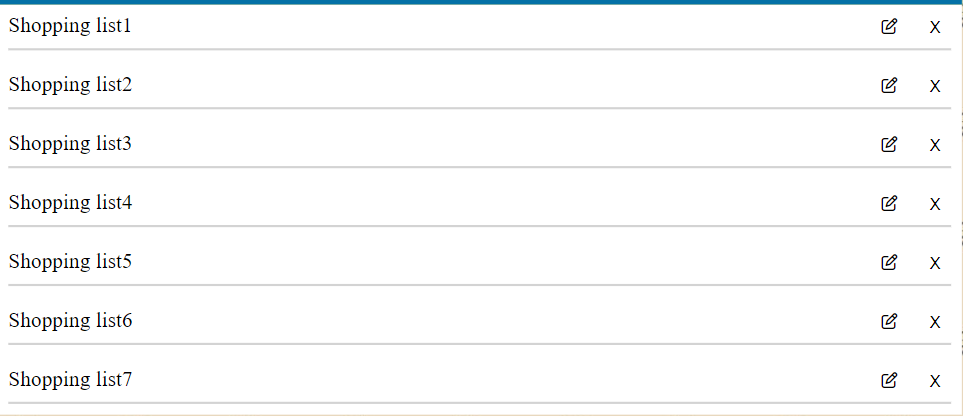

# ShopSmart

(Developer: Sreeshma Tharammal)

[Live webpage](https://sreeshmatharammal.github.io/ShopSmart/)

## Table of Content

1. [Project Goals](#project-goals)
    1. [User Goals](#user-goals)
2. [User Experience](#user-experience)
    1. [Target Audience](#target-audience)
    2. [User Requirements and Expectations](#user-requirements-and-expectations)
    3. [User Stories](#user-stories)
3. [Design](#design)
    1. [Design Choices](#design-choices)
    2. [Colors](#colors)
    3. [Fonts](#fonts)
    4. [Structure](#structure)
    5. [Wireframes](#wireframes)
4. [Technologies Used](#technologies-used)
    1. [Languages](#languages)
    2. [Frameworks](#frameworks)
    3. [Tools](#tools)
    4. [Pages](#pages)
5. [Features](#features)
6. [Validation and Testing](#validation-and-testing)
    1. [HTML Validation](#html-validation)
    2. [CSS Validation](#css-validation)
    3. [JavaScript Validation](#javascript-validation)
    4. [Accessibility](#accessibility)
    5. [Performance](#performance)
    6. [Device testing](#device-testing)
    7. [Browser compatibility](#browser-compatibility)
    8. [Testing user stories](#testing-user-stories)
7. [Bugs](#bugs)
8. [Deployment](#deployment)
9. [Credits](#credits)
    1. [Media](#media)
    2. [Code](#code)
    3. [Acknowledgements](#acknowledgements)
10. [License](#license)

## Project Goals

### User Goals

- Have a small app to track items for shopping
- Create different lists, for each list create multiple items, search shopping lists
- Display items for shopping list and provide option to mark as done
- Use shop smart locally

### Site Owner Goals

- Help user with a small app to track shopping items

## User Experience

### Target Audience

- Every day people who want a small browser based app to track shopping items
- People who are unorganised
- People who don't like to send their data to a server

### User Requirements and Expectations

- Easy to use and easy to understand
- Can do basic requirments to create list, multiple items, delete and search for shopping items
- Can mark items as done once shopping is comlete

### User Stories

As a user I want to:

1. Create multiple lists
2. User should be able to provide a name for the list
3. View all list
4. Delete list
5. Edit list name
6. Search for list
7. Create multiple items for each list
8. View items for a list
9. Delete items
10. Delete all items
11. Mark an item as 'Done'
12. Show tooltip for all buttons
13. See the code and how its made
14. User should be able to navigate to items from search result

## Design

### Colors (TODO)

The website is mainly white with black text but the accent color is a custom color.  
The colors can changed in the user settings. The following colors are available:  

### Font (TODO)

The Inter font from Google Fonts was chosen for its visual clarity. It is easily readable and friendly to the eye. The second font is sans-serif if the font is not loading.  
[Link to Inter font](<https://fonts.google.com/specimen/Inter>)

#### Task list

The task list shows the list of tasks categorised in active and done tasks. Clicking one task will show it in the overview.
Tasks can be marked as done on the left with the checkcircle.  

#### Task overview

The task overview shows the details of the current selected task, such as: Title, description, due date and alert date.  
The user can edit the task, delete it or mark it as done in the overview.  

#### There are three different modals that can pop up

- Add/Edit task (depending on the state)
- User settings
- Newsletter (Only pops up when prompted at the bottom)

### Wireframes

## Technologies Used  

### Languages

- HTML  
- CSS
- JavaScript

### Frameworks

- Font Awesome
- Google Fonts

### Tools

- Git
- GitHub
- Visual Studio Code
- Balsamiq

## Features

### List header

- Shows the list heading
- Shows the new list add button
- Shows the search list option
- User stories covered: 1, 5

### List view

- Displays list for shopping
- Allows user to delete a list
- Allows user to edit list name
- User stories covered: 2, 3, 4

### Add new list

- Allows user to provide list name and save
- Allows user to cancel 
- User stories covered: 2

### Add items to list

- Shows selected list name
- Allows user to add items to the list
- List all items in the list
- Allows user to delete an item
- Allows user to delete all items from the list
- Allows user to mark the item shopping is finished
- User stories covered: 7, 8, 9, 10, 11

### Search list

- Allows user to search for an list
- All list which are included should be visible
- User should be able to navigate to items from search result 
- User stories covered: 6, 14

### Footer

- Shows the author of the app
- Shows the link to the github repository of the app
- User stories covered: 13

