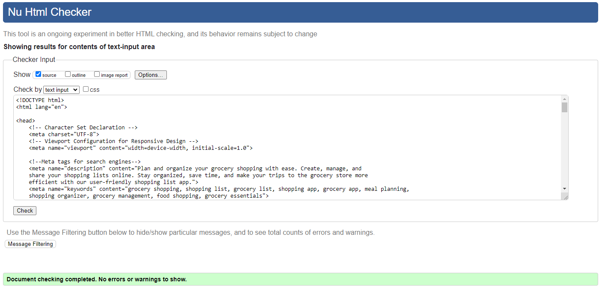

# ShopSmart

(Developer: Sreeshma Tharammal)

[Live webpage](https://sreeshmatharammal.github.io/ShopSmart/)

## Table of Content

1. [Project Goals](#project-goals)
    1. [User Goals](#user-goals)
    2. [Site Owner Goals](#site-owner-goals)
2. [User Experience](#user-experience)
    1. [Target Audience](#target-audience)
    2. [User Requirements and Expectations](#user-requirements-and-expectations)
    3. [User Stories](#user-stories)
3. [Design](#design)
    1. [Colors](#colors)
    2. [Fonts](#fonts)
    3. [Wireframes](#wireframes)
4. [Technologies Used](#technologies-used)
    1. [Languages](#languages)
    2. [Frameworks](#frameworks)
    3. [Tools](#tools)
5. [Features](#features)
6. [Validation and Testing](#validation-and-testing)
    1. [HTML Validation](#html-validation)
    2. [CSS Validation](#css-validation)
    3. [JavaScript Validation](#javascript-validation)
    4. [Accessibility](#accessibility)
    5. [Performance](#performance)
    6. [Device testing](#device-testing)
    7. [Browser compatibility](#browser-compatibility)
    8. [Testing user stories](#testing-user-stories)
7. [Bugs](#bugs)
8. [Deployment](#deployment)
9. [Credits](#credits)
    1. [Media](#media)
    2. [Code](#code)
    3. [Acknowledgements](#acknowledgements)

## Project Goals

### User Goals

- Have a small app to track items for shopping
- Create different lists, for each list create multiple items, search shopping lists
- Display items for shopping list and provide option to mark as done
- Use shop smart locally

### Site Owner Goals

- Help user with a small app to track shopping items

## User Experience

### Target Audience

- Every day people who want a small browser based app to track shopping items
- People who are unorganised
- People who don't like to send their data to a server

### User Requirements and Expectations

- Easy to use and easy to understand
- Can do basic requirments to create list, multiple items, delete and search for shopping items
- Can mark items as done once shopping is comlete

### User Stories

As a user I want to:

1. Create multiple lists
2. Provide an unique name for the list
3. View all list
4. View all items for a list
5. Create multiple items for a list
6. Delete an item
7. Delete all items
8. Mark an item as 'Done'
9. Delete a list
10. Edit a list name
11. Search for list
12. Navigate to items view from search result
13. See the code and how its made

## Design

### Colors 

The following colors are used:  

### Fonts 

The Lemon font from Google fonts was chosen for logo for its style.
[Link to Lemon font](<https://fonts.google.com/specimen/Lemon>)

The Inter font from Google Fonts was chosen for its visual clarity. It is easily readable and friendly to the eye. The second font is sans-serif if the font is not loading.  
[Link to Inter font](<https://fonts.google.com/specimen/Inter>)

### Wireframes

 
Home Screen

 

 
Items List Screen

 

 
Create New List

 

 
Edit List Name

 

## Technologies Used  

### Languages

- HTML  
- CSS
- JavaScript

### Frameworks

- Font Awesome
- Google Fonts

### Tools

- Git
- GitHub
- Visual Studio Code
- Balsamiq

## Features

### List header

- Shows the list heading
- Shows the new list add button
- Shows the search list option
- User stories covered: 1, 11

### List view

- Displays list for shopping
- Allows user to delete a list
- Allows user to edit list name
- User stories covered: 3, 9, 10

### Add new list

- Allows user to provide list name and save
- Allows user to cancel 
- User stories covered: 2

### Add items to list

- Shows selected list name
- Allows user to add items to the list
- List all items in the list
- Allows user to delete an item
- Allows user to delete all items from the list
- Allows user to mark the item shopping is finished
- User stories covered: 4, 5, 6, 7, 8

### Search list

- Allows user to search for an list
- All list which are included should be visible
- User should be able to navigate to items from search result 
- User stories covered: 11, 12

### Footer

- Shows the author of the app
- Shows the link to the github repository of the app
- User stories covered: 13

## Validation and Testing

### HTML Validation

All HTML validation tests have been passed.  

 
Index page

 

 
404 page

 

### CSS Validation

The full website gets errors in the CSS validation test from the font awesome framework.  
Validating the single files passes the tests.  
Variables can't be validated, they show up as warnings.  

 
CSS

 

### JavaScript Validation

No errors were found when passing through [jshint](https://jshint.com/).  

The filterLists unused variable - event handler defined in HTML.

 
Script validation from the browser

 

### Accessibility

All Wave accessibility tests pass with no errors and alerts.

 
Index page

 

### Performance

The lighthouse tests were good.  
Below are all reports to every page.

 
Index page

 

### Device testing

The website was tested on the following devices:

- Windows 11 PC (Screen resolution: 2560x1440)
- Samsung S22 with Android 11 (Screen resolution: 1080x2340)

Other screen resolutions were tested in the browser with dev tools from 2560x1440 down to 320x568.

### Browser compatibility

The following browser were tested:

- Microsoft Edge (Chromium based version)
- Google Chrome

Webkit based browser (Safari) could not be tested. 

### Testing user stories

#### As a user I want to

1. Create multiple lists

|Feature|Action|Expected result|Actual result|
|---|---|---|---|
Add list|Press 'Add lists' button and provide list name and press Save button |New list can be created|Works as expected|

 
Screenshot

2. Provide an unique name for the list

|Feature|Action|Expected result|Actual result|
|---|---|---|---|
List name|Click on 'Add List' name which shows 'New List' window. Provide list name and press 'Save' button | List name is saved and provides error message if list name already exists or list name is empty |Works as expected|

 
Screenshot

 
  
 
  
 

3. View all list

|Feature|Action|Expected result|Actual result|
|---|---|---|---|
List view|List view is main screen which disaplys all lists which are created by user|All lists created by user are visible|Works as expected|

 
Screenshot

 

4. View all items for a list

|Feature|Action|Expected result|Actual result|
|---|---|---|---|
Items to the list|Press 'Add List' view or click on List from List view. If 'Add List', once list name is provided and 'Save' button is clicked, Item view will be displayed. If pressesd on List view, Item view will be disaplyed directly. Previous checked status of an item also displayed.|Displays all items for the selected list. Also, selected list name is disaplyed in the list view|Works as expected|

 
Screenshot

 

5. Create multiple items for a list

|Feature|Action|Expected result|Actual result|
|---|---|---|---|
Item add to a list|From item view, Press 'Add Item' button. Provide an item name and press 'Add' button|Item is added to the item view |Works as expected|

 
Screenshot

 
  
 

6. Delete an item

|Feature|Action|Expected result|Actual result|
|---|---|---|---|
Delete an item for a list|From item view, Press 'X' button corresponding to an item|Item deleted from the item view |Works as expected|

 
Screenshot

 
  
 

7. Delete all items

|Feature|Action|Expected result|Actual result|
|---|---|---|---|
Delete all items for a list|From item view, Press 'Delete all items' button. Confirmation message is disaplyed and if press 'OK' all items for a list are deleted. If 'Cancel' button is pressed, items are not deleted.|All Items are deleted from the item view |Works as expected|

 
Screenshot

 
  
 
  
 

8. Mark an item as 'Done'

|Feature|Action|Expected result|Actual result|
|---|---|---|---|
Ability to mark an item is 'Done'|From item view, Toggle item status to mark the item as 'Done'.|It is possible to toggle individual items and change status |Works as expected|

 
Screenshot

 

9. Delete a list.

|Feature|Action|Expected result|Actual result|
|---|---|---|---|
Delete list|Click on 'X' button against a list view|Delete confirmation message is shown and if select 'OK', list is deleted from the view|Works as expected|

 
Screenshot

 
  
 
  
 

10. Edit a list name

|Feature|Action|Expected result|Actual result|
|---|---|---|---|
Rename list name|Click edit button from list view. From edit list window provide new name and click 'SAVE' button.|New name is displayed in the list view and all items corresposnding to old list are visible in the items view.|Works as expected|

 
Screenshots

 

11. Search for a list

|Feature|Action|Expected result|Actual result|
|---|---|---|---|
Search for a list from list view|From home page, in the search option enter text.| All list which are included will be displayed|Works as expected|

 
Screenshot

  
  
 

12. Navigate to items view from search result

|Feature|Action|Expected result|Actual result|
|---|---|---|---|
Items view from search result|From search result click on a list.|All items for the list are visible in the items view.|Works as expected|

 
Screenshot

 
  
 

#### As an owner I want the user to

13. See the code and how its made

|Feature|Action|Expected result|Actual result|
|---|---|---|---|
Footer GitHub link|Click the GitHub icon at the bottom of page|Shows the repository|Works as expected|

 
Screenshot

 

## Bugs

|Status|Bug|Fix|
|---|---|---|
|Fixed|Placeholder is missing for empty list screen onload.|Added innerHtml if the list read from loacl storage is empty.|
|Fixed|Delete all items shows the confirmation message if the item is empty.|Added check for empty item before showing confirmation message|

## Deployment

1. In the GitHub repository navigate to the "Settings" tab
2. On the left hand menu select "Pages"
3. For the source select Branch: master
4. After the webpage refreshes automatically you will see a box at the top saying: "Your site is live at <https://sreeshmatharammal.github.io/ShopSmart/>"

You can fork the repository by following these steps:

1. Go to the repository on GitHub  
2. Click on the "Fork" button in the upper right hand corner

You can clone the repository by following these steps:

1. Go to the repository on GitHub
2. Locate the "Code" button above the list of files and click it  
3. Select if you prefer to clone using HTTPS, SSH, or Github CLI and click the "copy" button to copy the URL to your clipboard
4. Open Git Bash
5. Change the current working directory to the one where you want the cloned directory
6. Type git clone and paste the URL from the clipboard ($ git clone <https://github.com/YOUR-USERNAME/YOUR-REPOSITORY>)  
7. Press Enter to create your local clone.

## Credits

### Media

Icons are taken from Font Awesome:  
[FontAwesome](<https://fontawesome.com/>)

Logo icon is taken flaticon:  
[Flaticon](https://www.flaticon.com/free-stickers/shopping-list)

### Code
Microsoft Copiot response for createDialogBox function

### Acknowledgements

- A special thanks to my mentor Iuliia Konovalova for feedback and advice.
- A thanks to the Code Institute for the great learning resources
